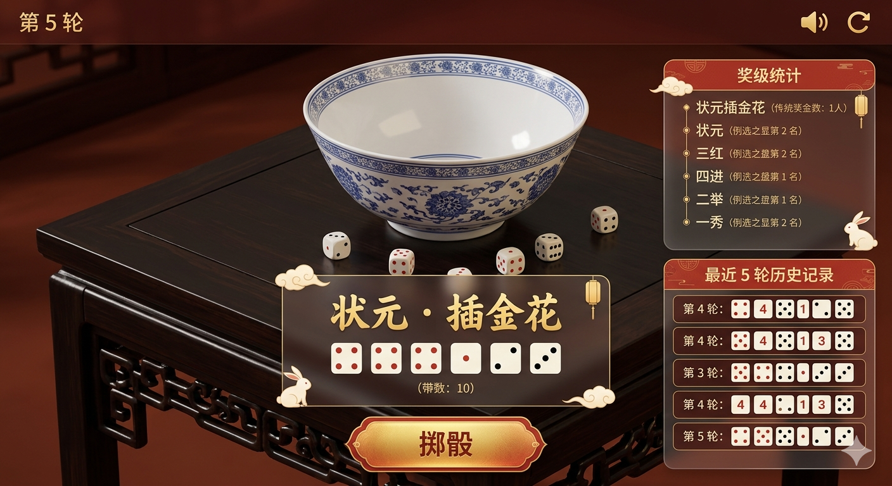

视觉风格：采用了**现代新中式 + 毛玻璃（Glassmorphism）**的效果。面板使用半透明材质，既能看清背后的 3D 场景，又保证了 UI 的独立性。边框和装饰使用了极简的金色传统纹样，温暖喜庆且克制典雅。

顶部栏：左侧清晰显示“第 5 轮”；右侧音效和重置按钮采用简洁的金色图标形式，置于暗色背景上非常醒目。

右侧面板：完全依照布局图放置。上方是“奖级统计”，由于 13 个奖级较多，这里展示了核心奖级作为示例；下方是“最近 5 轮历史记录”，以直观的 2D 骰子图标展示每轮结果。

底部核心区：

结果面板：位于大瓷碗下方，突出显示大号奖级名称（示例为最高级“状元·插金花”），下方横向排列 6 个骰子，点数“四”严格使用红色。

掷骰按钮：最下方是富有质感的金色大尺寸按钮，文字为“掷骰”，适合鼠标点击和触摸操作。

核心配色方案 (HEX)：
主色调（喜庆红）: #C0392B （用于“四”点、按钮点缀）

点缀色（雅致金）: #D4AF37 （用于边框、图标、主要文字）

主文字/背景（米白）: #F8F4E6 （用于次要说明文字）

UI 面板背景（暗色毛玻璃）: rgba(44, 30, 22, 0.6) （带 blur 效果）

